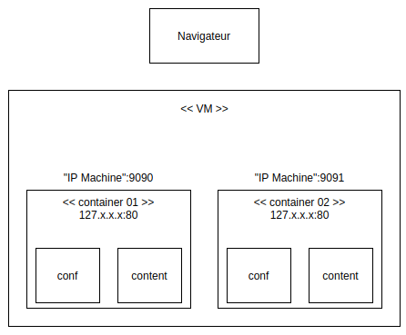

# RES_2021_Labo4_HttpInfra

> Auteurs: Robin Gaudin & Noémie Plancherel

/!\ Ajouter description du projet /!\

## Etat initial

Pour tester et suivre le contenu de ce répertoire GitHub, il faut avoir préalablement installé `Docker` sur votre machine.

## Etape 1: Serveur HTTP statique avec apache httpd

### Objectifs

- Mettre en place un serveur apache httpd
- L'implémenter dans une image Docker
- Ajout de contenu HTML basique

### Infrastructure

Pour cette première étape, l'infrastructure de l'image Docker se trouve dans le répertoire `./docker-images/apache-php-image`.

#### Dossier `src`

Le dossier `src` contient les fichiers sources du site Web.

#### Fichier `Dockerfile`

Contenu:

```dockerfile
FROM php:7.2-apache
COPY src/ /var/www/html/
```

Ce fichier permet de configurer l'image Docker du serveur apache httpd.

Le `FROM` permet de définir l'image de base, ici nous héritons de l'image `7.2-apache` de `php`.

Le `COPY` va aller copier le contenu du dossier `src` vers le répertoire `/var/www/html/`. Nous allons voir plus tard ce qu'est ce répertoire.

#### Fichier `build-images.sh`

Contenu:

```bash
#!/bin/bash
docker build -t res-http/apache-php .
```

Ce fichier permet de construire l'image Docker qui a été configurée dans le fichier `Dockerfile`.

Le paramètre `-t` permet de spécifier un nom à l'image, ici `res-http/apache-php`.

#### Fichiers `run-container-01.sh` et `run-container-02.sh`

Contenu `run-container-01.sh` :

```bash
#!/bin/bash
docker run -d -p 9090:80 res-http/apache-php
```

Contenu `run-container-02.sh` :

```bash
#!/bin/bash
docker run -d -p 9091:80 res-http/apache-php
```

Ces deux fichiers permettent de créer un container sur l'image construite avec le script `build-images.sh`. Il y en a deux, avec une seule différence qui est le port de la machine locale utilisé, afin de pouvoir créer deux containers.

Le paramètre `-d` permet de lancer le container en arrière-plan.

Le paramètre `-p` permet de faire du "port mapping" en spécifiant le port de la machine locale à utiliser (ici `9090` ou `9091`) et le port du service exécuté dans le container (ici `80`).

Nous voyons également que l'on reprend le nom de l'image construite (`res-http/apache-php`).

### Démonstration

1. Cloner le projet dans le répertoire de votre choix

   ```bash
   git clone git@github.com:Nono98/RES_2021_Labo4_HttpInfra.git
   ```

2. Se rendre dans le répertoire `RES_2021_Labo4_HttpInfra/docker-images/apache-php-image` et exécuter les scripts (en premier temps le script `build-images.sh`)

   ```bash
   cd RES_2021_Labo4_HttpInfra/docker-images/apache-php-image
   ./build-images.sh
   ./run-container-01.sh
   ./run-container-02.sh
   ```
   Cela va construire l'image et créer les deux containers, pour donner une structure semblable à celle-ci:
   
   
   
3. 
