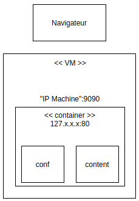
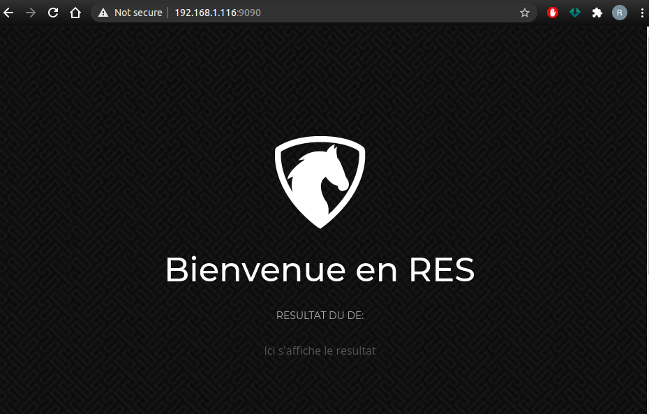
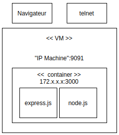
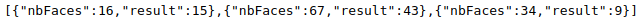
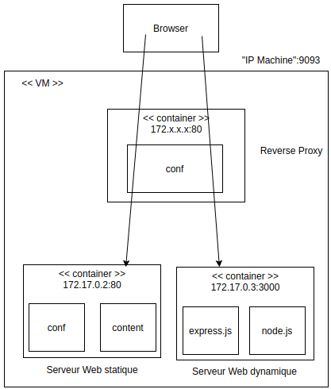
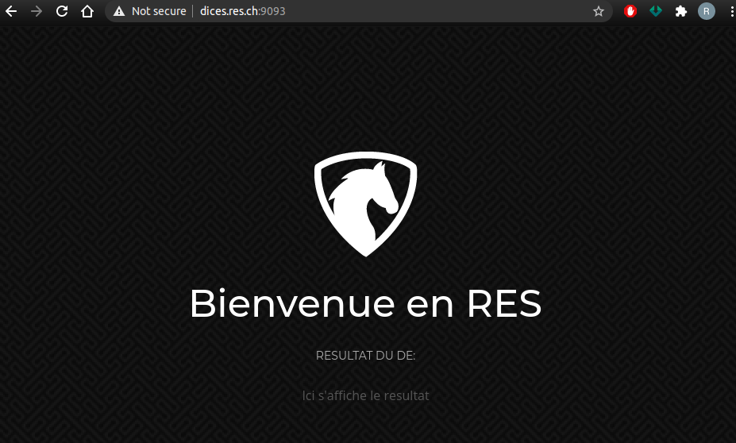

# RES_2021_Labo4_HttpInfra

> Auteurs: Robin Gaudin & Noémie Plancherel

/!\ Ajouter description du projet /!\

## Etat initial

Pour tester et suivre le contenu de ce répertoire GitHub, il faut avoir préalablement installé `Docker` sur votre machine.

## Etape 1: Serveur HTTP statique avec apache httpd

### Objectifs

- Mettre en place un serveur apache httpd
- L'implémenter dans une image Docker
- Ajout de contenu HTML basique

### Infrastructure

Pour cette première étape, l'infrastructure de l'image Docker se trouve dans le répertoire `./docker-images/apache-php-image`.

#### Dossier `src`

Le dossier `src` contient les fichiers sources du site Web.

#### Fichier `Dockerfile`

Contenu:

```dockerfile
FROM php:7.2-apache
COPY src/ /var/www/html/
```

Ce fichier permet de configurer l'image Docker du serveur apache httpd.

Le `FROM` permet de définir l'image de base, ici nous héritons de l'image `7.2-apache` de `php`.

Le `COPY` va aller copier le contenu du dossier `src` vers le répertoire `/var/www/html/`.

#### Fichier `build-images.sh`

Contenu:

```bash
#!/bin/bash
docker build -t res-http/apache-php .
```

Ce fichier permet de construire l'image Docker qui a été configurée dans le fichier `Dockerfile`.

Le paramètre `-t` permet de spécifier un nom à l'image, ici `res-http/apache-php`.

#### Fichiers `run-container.sh

Contenu:

```bash
#!/bin/bash
docker run -d -p 9090:80 res-http/apache-php
```

Ce fichier permet de créer un container sur l'image construite avec le script `build-images.sh`. 

Le paramètre `-d` permet de lancer le container en arrière-plan.

Le paramètre `-p` permet de faire du "port mapping" en spécifiant le port de la machine locale à utiliser (ici `9090`) et le port du service exécuté dans le container (ici `80`).

Nous voyons également que l'on reprend le nom de l'image construite (`res-http/apache-php`).

### Démonstration

1. Cloner le projet dans un répertoire

   ```bash
   git clone git@github.com:Nono98/RES_2021_Labo4_HttpInfra.git
   ```

2. Se rendre dans le répertoire `RES_2021_Labo4_HttpInfra/docker-images/apache-php-image` et exécuter les scripts (en premier temps le script `build-images.sh`)

   ```bash
   cd RES_2021_Labo4_HttpInfra/docker-images/apache-php-image
   ./build-images.sh
   ./run-container.sh
   ```
   Cela va construire l'image et le container, pour donner une structure semblable à celle-ci:
   
   
   
3. Il faut maintenant récupérer l'IP de la machine locale (que l'on voit également dans la capture ci-dessus), afin de se connecter sur le serveur apache que l'on vient de lancer. Pour ce faire, il faut exécuter la commande suivante et localiser l'adresse de la machine.

   ```bash
   ip addr
   ```

4. Pour se connecter, il faut aller sur un navigateur et taper l'adresse IP récupérée suivie de `:9090` dans la barre d'adresse. Par exemple: 192.168.1.116:9090

   On peut maintenant apercevoir le site Web:

   

   On peut également aller plus loin en explorant quelque peu la configuration du serveur apache avec les étapes suivantes:

5. Récupérer le nom du container créé en tapant la commande:

   ```bash
   docker ps
   ```

   On obtient le résultat suivant:

   CONTAINER ID   IMAGE                 COMMAND                  CREATED          STATUS          PORTS                                   NAMES
   d57f4407ee3c   res-http/apache-php  "docker-php-entrypoi…"   15 minutes ago   Up 15 minutes   0.0.0.0:9090->80/tcp, :::9090->80/tcp   `unruffled_turing`
   
   Le nom sera différent puisqu'il est généré aléatoirement.
   
6. Le nom récupéré va nous servir à se connecter directement sur le container avec la commande suivante:

   ```bash
   docker exec -it unruffled_turing /bin/bash
   ```

   Le nom du container `unruffled_turing` à remplacer par celui trouvé par la commande précédente.

   Nous sommes maintenant connecté directement sur la machine et pouvons exécuter les commandes souhaitées.

7. Il faut maintenant se rendre dans le répertoire `/etc/apache2` avec la commande:

   ```bash
   cd /etc/apache2
   ```

   C'est ici que les fichiers de configuration se situent (que l'on peut voir avec la commande `ls`), notamment dans le répertoire `sites-available` et le fichier `000-default.conf` que l'on voit ci-dessous:

   

8. Enfin, pour quitter le terminal, il suffit simplement d'exécuter la commande `exit`.

## Etape 2: Serveur HTTP dynamique avec express.js

### Objectifs

- Ecrire une application HTTP en Node.js, qui retourne un payload sur une requête GET
- Apprendre comment utiliser `Postman` pour tester des applications HTTP

### Infrastructure

Pour cette deuxième étape, l'infrastructure de l'image Docker se trouve dans le répertoire `./docker-images/express-image`.

#### Dossier `src`

Le dossier `src` contient les fichiers sources nécessaires pour l'application JSON.

#### Fichier `Dockerfile`

Contenu:

```dockerfile
FROM node:15.13.0
COPY src/ /opt/app
CMD ["node", "/opt/app/index.js"]
```

Ce fichier permet de configurer l'image Docker du serveur apache httpd.

Le `FROM` permet de définir l'image de base, ici nous héritons de l'image `node` en version `15.13.0`.

Le `COPY` va aller copier le contenu du dossier `src` vers le répertoire `/opt/app`.

Le `CMD` permet de lancer une commande, ici `node /opt/app/index.js`.

#### Fichier `build-images.sh`

Contenu:

```bash
#!/bin/bash
docker build -t res-express .
```

Ce fichier permet de construire l'image Docker qui a été configurée dans le fichier `Dockerfile`.

Le paramètre `-t` permet de spécifier un nom à l'image, ici `res-express`.

#### Fichier `run-container.sh`

Contenu:

```bash
#!/bin/bash
docker run -p 9091:3000 res-express
```

Ce fichier permet de créer un container sur l'image construite avec le script `build-images.sh`.

Le paramètre `-p` permet de faire du "port mapping" en spécifiant le port de la machine locale à utiliser (ici `9091`) et le port du service exécuté dans le container (ici `3000`).

Nous voyons également que l'on reprend le nom de l'image construite (`res-express`).

### Démonstration

Notre application génère un certain nombre de lancé de dés (entre 0 et 10), et affiche le numéro du lancé aisni que le résultat.

1. Cloner le projet dans un répertoire si cela n'a pas déjà été fait avec l'étape précédente

   ```bash
   git clone git@github.com:Nono98/RES_2021_Labo4_HttpInfra.git
   ```

2. Se rendre dans le répertoire `RES_2021_Labo4_HttpInfra/docker-images/express-image` et exécuter les scripts (en premier temps le script `build-images.sh`)

   ```bash
   cd RES_2021_Labo4_HttpInfra/docker-images/express-image
   ./build-images.sh
   ./run-container.sh
   ```

   Cela va construire l'image et créer le container, pour donner une structure semblable à celle-ci:

   

3. Il faut maintenant récupérer l'IP de la machine locale (que l'on voit également dans la capture ci-dessus), afin de se connecter sur le serveur apache que l'on vient de lancer. Pour ce faire, il faut exécuter la commande suivante et localiser l'adresse de la machine.

   ```bash
   ip addr
   ```

4. Pour se connecter, il faut aller sur un navigateur et taper l'adresse IP récupérée suivie de `:9091` dans la barre d'adresse. Par exemple: 192.168.1.116:9091

   On peut maintenant apercevoir le résultat, où `launchNumber` est le numéro du lancé, et `result` est le résultat du lancé:

   

## Etape 3: Reverse proxy avec apache (configuration statique)

### Objectifs

- Utiliser apache httpd pour créer un reverse proxy
- S'assurer que toutes les requêtes HTTP passent par le reverse proxy
- Router les requêtes sur les applications apache http ou node.js en fonction du prefixe de l'URL

### Infrastructure

Pour cette troisième étape, l'infrastructure de l'image Docker se trouve dans le répertoire `./docker-images/apache-reverse-proxy-image`.

#### Dossier `conf`

Le dossier `conf` contient la configuration nécessaire pour le reverse proxy, notamment le fichier `001-reverse-proxy.conf`:

```bash
<VirtualHost *:80>
    ServerName dices.res.ch
    
    ProxyPass "/api/dices/" "http://172.17.0.3:3000/"
    ProxyPassReverse "/api/dices/" "http://172.17.0.3:3000/"

    ProxyPass "/" "http://172.17.0.2:80/"
    ProxyPassReverse "/" "http://172.17.0.2:80/"
</VirtualHost>
```

Cela va permettre de faire les redirections vers les 2 containers contenant le site web statique et le site web dynamique, avec comme hôte de destination `dices.res.ch`.

#### Fichier `Dockerfile`

Contenu:

```dockerfile
FROM php:7.2-apache
COPY conf/ /etc/apache2

RUN a2enmod proxy proxy_http
RUN a2ensite 000-* 001-*
```

Ce fichier permet de configurer l'image Docker du serveur apache reverse proxy.

Le `FROM` permet de définir l'image de base, ici nous héritons de l'image `7.2-apache` de `php`.

Le `COPY` va aller copier le contenu du dossier `conf` vers le répertoire `/etc/apache2`.

Les commandes `RUN` permettent d'appliquer la configuration.

#### Fichier `build-images.sh`

Contenu:

```bash
#!/bin/bash
cd ../apache-php-image
./build-images.sh
cd ../express-image
./build-images.sh
cd ../apache-reverse-proxy-image
docker build -t res-apache-rp .
```

Ce fichier permet de construire les 3 images Docker nécessaires afin de s'assurer qu'elles soient bien toutes créées.

Le paramètre `-t` permet de spécifier un nom à l'image, ici `res-apache-rp`.

#### Fichier `run-container.sh`

Contenu:

```bash
#!/bin/bash
docker run -d --name apache-static res-http/apache-php
docker run -d --name express-dynamic res-express
docker run -d -p 9093:80 res-apache-rp
```

Ce fichier permet de créer les 3 containers sur les images construites avec le script `build-images.sh`.

Le paramètre `-p` permet de faire du "port mapping" en spécifiant le port de la machine locale à utiliser (ici `9093`) et le port du service exécuté dans le container (ici `80`).

Nous voyons également que l'on reprend le nom de l'image construite (`res-apache-rp`).

### Démonstration

1. Cloner le projet dans un répertoire si cela n'a pas déjà été fait avec les étapes précédentes

   ```bash
   git clone git@github.com:Nono98/RES_2021_Labo4_HttpInfra.git
   ```

2. S'assurer qu'il n'y ait aucun container lancé concernant les étapes 1 et 2 en exécutant la commande:

   ```bash
   docker ps
   ```

   Si il y en a, alors il faut le(s) supprimer avec la commande:

   ```bash
   docker kill "nom du container"
   ```

   Où le nom du container est celui trouvé avec la commande `docker ps`. (Voir démonstration étape 1, point 5)

3. Exécuter le script de construction d'image pour les 3 containers et lancer les différents containers nécessaires:

   ```bash
   cd RES_2021_Labo4_HttpInfra/docker-images/apache-reverse-proxy-image
   ./build-images.sh
   ./run-containers.sh
   ```

   Il faudra bien vérifier que les adresses IP des containers soient `172.17.0.2` et `172.17.0.3`.

   Cela va construire les images et créer les container, pour donner une structure semblable à celle-ci:

   

4. Ajouter une entrée dans le fichier `hosts` du système (`/etc/hosts` sur Linux)

   ```bash
   192.168.1.116   dices.res.ch
   ```

   Où `192.168.1.116` est l'adresse IP de la machine locale, voir étape 1 point 3 pour la récupérer.

5. Accéder aux sites via le navigateur

   1. Site statique, accès au site créé dans l'étape 1

      

   2. Site dynamique, le lien fonctionne et retourne ce que l'on veut

      

   3. Erreur dans l'URL, le fichier recherché n'est pas trouvable

      

   4. Impossible de se connecter directement aux containers, il faut passer par le reverse proxy

      

## Etape 4: Requêtes AJAX avec JQuery

### Objectifs


### Infrastructure


### Démonstration


## Etape 5: Configuration reverse proxy dynamique

### Objectifs


### Infrastructure


### Démonstration

